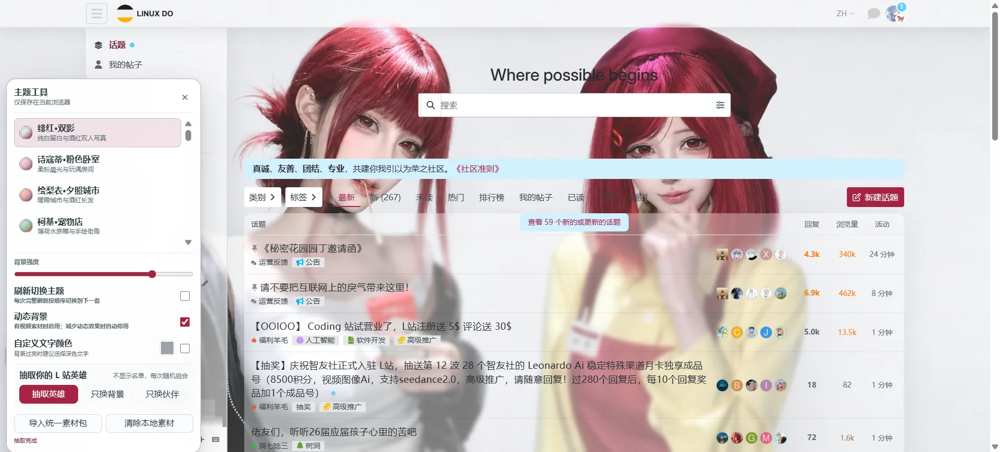
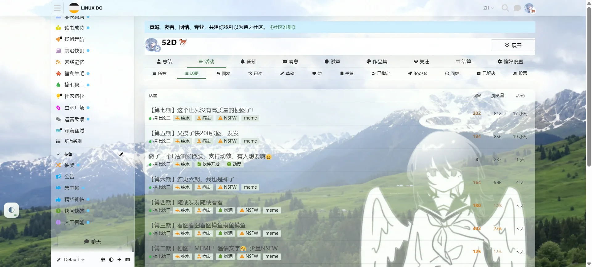
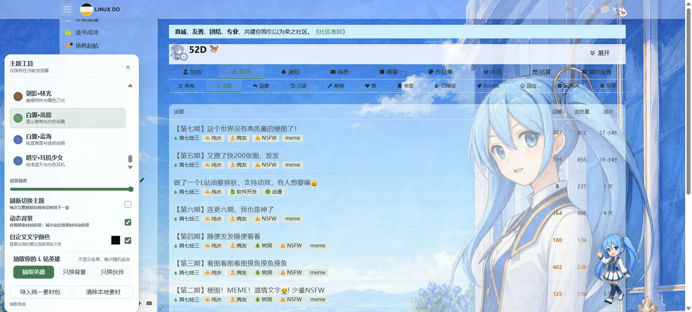
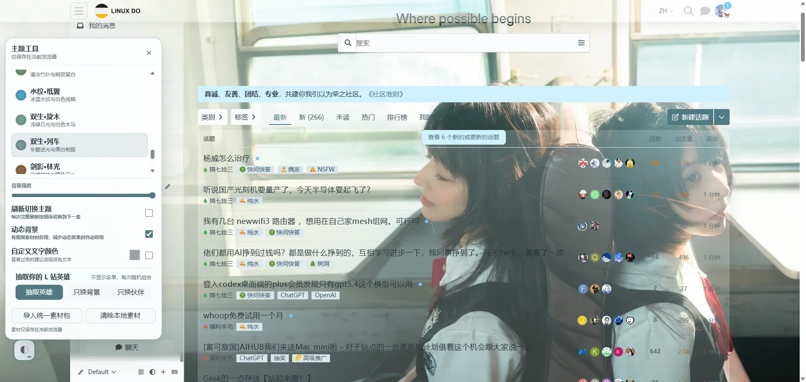
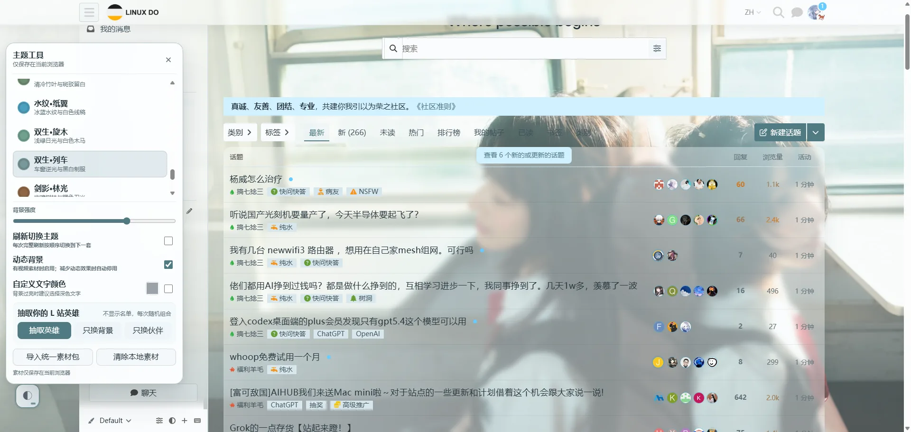

# LINUX DO Theme Suite

LINUX DO Theme Suite 是适用于 `https://linux.do/*` 的本地油猴主题工具。V1 包含 41 套常规主题、动态背景、本地素材导入、随机英雄背景与透明伙伴，以及背景强度、主题轮播和文字颜色设置。

所有设置和导入素材均保存在当前浏览器，不读取账号凭据，也不会把图片、视频或站内内容上传到服务器。

## 界面

主题面板包含主题切换、背景强度、刷新轮播、动态背景、文字颜色、随机英雄和统一素材包操作。



随机英雄背景可独立抽取；切换常规主题后，已抽取伙伴继续保留。



随机英雄伙伴可与背景同时抽取，也可单独更换。



页面加载期间显示独立加载画面，并保留主题工具悬浮入口。


### 背景强度对比

背景强度会同步调整背景可见度、内容面板透明度、毛玻璃和页面渐隐。

| 高强度 | 中等强度 |
|---|---|
|  |  |

## 下载 V1

| 文件 | 用途 |
|---|---|
| [V1 新手整合包（首选）](https://github.com/kourou25/linuxdo-theme-suite/releases/latest/download/linuxdo-theme-suite-v1.0.0-starter-kit.zip) | 一次下载和解压即可获得脚本、全部素材与手册 |
| [轻量 UserScript](https://github.com/kourou25/linuxdo-theme-suite/releases/latest/download/linuxdo-theme-suite-v1.0.0-core.user.js) | 只更新脚本时使用 |
| [统一素材包](https://github.com/kourou25/linuxdo-theme-suite/releases/latest/download/linuxdo-theme-suite-v1.0.0-suite-pack.zip) | 只更新常规主题、动态素材和随机英雄时使用 |
| [完整 UserScript](https://github.com/kourou25/linuxdo-theme-suite/releases/latest/download/linuxdo-theme-suite-v1.0.0-full.user.js) | 高级离线版，内置 41 套静态主题，文件较大 |
| [操作手册](docs/操作手册.md) | 安装、更新、使用、卸载和故障处理 |

全部发布文件、SHA-256 校验值和版本说明位于 [Releases](https://github.com/kourou25/linuxdo-theme-suite/releases)。

普通用户不要使用 GitHub 自动生成的“Source code”压缩包进行安装；该压缩包仅包含开发源码。请下载上表第一项“V1 新手整合包”。

## 安装

1. 安装 Tampermonkey 或 Violentmonkey。
2. 下载并解压 `linuxdo-theme-suite-v1.0.0-starter-kit.zip`。
3. 打开其中的 `01-安装主题脚本.user.js` 完成安装。
4. 打开或刷新 LINUX DO，点击主题工具悬浮按钮。
5. 点击“导入统一素材包”，选择整合包中的 `02-统一素材包` 文件夹。

整合包根目录的 `00-开始使用.txt` 包含同样的快速步骤。素材目录必须保留 `manifest.json`、`images/`、`videos/`、`backgrounds/` 和 `companions/` 的结构。

需要分开更新时，可单独下载约 120 KB 的轻量脚本或统一素材包。完整脚本内置 41 套图片，体积超过 11 MB，油猴编辑器在粘贴或保存时可能短暂无响应。

## 功能

- 41 套浅色、暗色、动漫、摄影、国风和场景主题；
- 可用主题的视频背景、静态回退、后台暂停和减少动态效果适配；
- “抽取你的 L 站英雄”，随机组合 16 套背景与透明伙伴；
- 切换常规主题时保留伙伴，并提供独立“关闭伙伴”按钮；
- 背景强度、内容透明度、毛玻璃和页面渐隐联动；
- 刷新时轮播常规主题；
- 自定义正文、导航和次要文字颜色；
- 可拖动并记忆位置的悬浮入口；
- 点击页面空白处、按 `Esc` 或使用关闭按钮收起工具面板；
- 常规主题与随机英雄背景互斥，伙伴作为独立层保留；
- 图片、视频和英雄资源使用 IndexedDB 本地存储。

## 从源码构建

环境要求：

- Node.js 24 或更高版本；
- Windows PowerShell 7；
- 生成完整媒体发布包时需要 FFmpeg 和对应源素材。

```powershell
npm run build
npm test
npm run check
```

构建结果位于 `dist/`：

- `linuxdo-theme-suite.user.js`：内置运行时静态主题；
- `linuxdo-theme-suite-core.user.js`：不内置图片，可导入自有素材包。

完整发布包使用以下命令生成：

```powershell
pwsh -NoProfile -File scripts/package-release.ps1 -Version 1.0.0
```

完整媒体发布功能使用独立的原始媒体目录；Git 仓库内的运行时压缩图可直接复现 UserScript 构建。

## 目录

| 路径 | 内容 |
|---|---|
| `src/` | UserScript 源码与样式 |
| `scripts/` | 构建、素材处理和发布脚本 |
| `tests/` | 运行时、素材包、主题状态和构建测试 |
| `assets/generated/runtime/` | 构建所需的运行时压缩图 |
| `docs/` | 操作手册和界面截图 |

## 兼容性

- 桌面端 Chromium 系浏览器；
- Tampermonkey 或 Violentmonkey；
- 页面地址匹配 `https://linux.do/*`；
- 移动端保留基础主题与面板适配，宽屏人物构图以桌面端为主要显示环境。

## 🌟 特别鸣谢

感谢 [LINUX DO](https://linux.do/) 社区提供开放、友善、专业的技术交流环境。本项目面向 LINUX DO 页面使用，并在社区用户的实际使用与反馈中持续完善。

前往 [LINUX DO 社区](https://linux.do/)。

## 许可证与素材

源代码、构建脚本和原创文档使用 [MIT License](LICENSE)。

图片、视频、Wallpaper Engine 工坊内容、角色形象及其衍生素材不适用 MIT License。来源范围和再分发边界见 [素材来源与许可说明](ASSET-SOURCES.md)。
